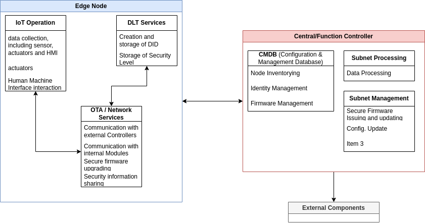
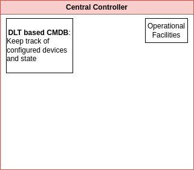
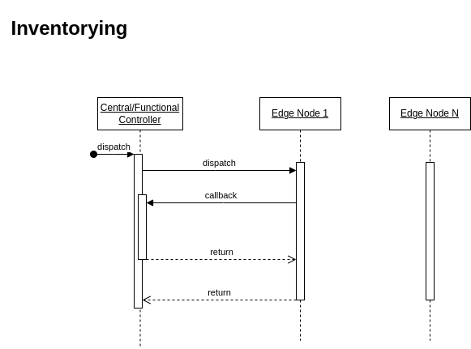

# Functional Architecture

> **Disclaimer**: Content partly used from CERTIFY Deliverable 1.1

<!--toc:start-->
- [Functional Architecture](#functional-architecture)
  - [Device Architectures](#device-architectures)
    - [Edge Nodes](#edge-nodes)
    - [Function and Central Controller Nodes](#function-and-central-controller-nodes)
  - [Onboarding](#onboarding)
  - [Inventorying](#inventorying)
  - [Operations (Day-2-Day)](#operations-day-2-day)
  - [Secure Firmware Updating](#secure-firmware-updating)
  - [Security-Information Sharing](#security-information-sharing)
    - [External Stakeholders](#external-stakeholders)
    - [Cybersecurity Assessment](#cybersecurity-assessment)
    - [Security Levels](#security-levels)
<!--toc:end-->

## Device Architectures

### Edge Nodes

<!--  -->

Each edge node will store its DID, security levels, other information e.g., firmware version.

DID will be created during onboarding and stored either inside a secure compartment, or be
cryptographically hashed, so that finally only that device is able to reproduce that DID.

- DID provided inside a DLT, which could be the one used by CERTIFY 'Hyperledger Aries'
  - Gets stored inside a cryptographic vault
  - https://identity.foundation/sidetree/spec/
  - https://w3c.github.io/did-core/

### Function and Central Controller Nodes

<!--  -->
<!--  -->

## Onboarding

> **TODO**

[Related Scenario: Installation of CCS](/thesis/1-use-cases.md#1-installation-of-connected-cabin-systems)

- DID generated on IoT device and VC gets issued by the manufacturer and returned to the device.
  - the VC gets verified by the infrastructure and also the auditor, while the auditor is able to
    revoke the certificate if needed.
    - Verification of Certificate, whether revoked or not, possible through e.g., a **smart
      contract** based on a **cryptographic accumulator**
- Storing of MUD file i.e. VC?
  - Secure Encryption, SE, unit of STM is no yet available
  - [ ] **define how storing will work!**
- Notification of deployment domain (Central/Functional controller) of
  - ID
  - behavioral profile
  - security policies
  - certificates

## Inventorying

> Emphasis 1 of thesis

> **TODO**

- DLT based Configuration and Management Database, CMDB on **Controllers**
  - of each device, security configuration, security levels
  - one example of could be [Cassandra](https://cassandra.apache.org/_/index.html)

In regard to our use cases, each edge node will be inventoried by either the **Central** or the
**Functional** Controller, depending on whether configuration **A** or **B** was chosen.

## Operations (Day-2-Day)

- Collection of changes and storing for sharing, which is done either at a later point, or
  instantaneously
- Establishment and identification of security level and required patches, if necessary
- Constant checking whether VC were revoked. Information happens through computationally more potent
  Central Controller

- Device will be re-certified if a new vulnerability is discovered

- Controller will have to monitor:
  Real-time security monitoring typically relies on the definition of events taxonomies which cover
  the detection of botnets, denial of service, brute force, port scanning, malware signatures in
  traffic, data tampering, SQL injections, attacks against SCADA systems, SSH issues or rootkits,
  to name but a few.
- intrusion prevention and detection systems (IPS and IDS), honeypots, network sniffers or
  vulnerability scanners become several of the most relevant sensors to gather security related
  information from a system.

## Secure Firmware Updating

> Emphasis 2 of the thesis

[Related Scenario: Installation of CCS](/thesis/1-use-cases.md#3-lru-replacement-and-re-purposing)

- only allow verified images
- **Lightweight Machine-to-Machine technical specification** by Open Mobile Alliance, OMA, based on
  transport layer security
- Software Updates for IoT, SUIT, by IETF, focuses on definition of communication architecture and
  information model of manifest files to describe firmware images based on recent security
  standards, e.g., CBOR Object Signing and Encryption, [COSE](https://cose-wg.github.io/cose-spec/),
  mainly focused on communication security aspects therefore need to combine with other mechanisms

- [IETF Software Update for IoT, SUIT](https://datatracker.ietf.org/wg/suit/about/)

- closer to the end devices, in such a way that the update/patching process can be carried out
  through secure and efficient mechanisms to reduce latency and network overhead

- use of Blockchains: transparent ledger to manage the different versions of software elements
  composing an IoT device or system

- Interledger approaches will be considered, as interoperability of multiple blockchains is
  important, in case different countries and manufacturers with different restrictions and
  vulnerabilities.

## Security-Information Sharing

<!--  -->

To enable security information sharing, we will be relying on the #Hyperledger platform

- Directional Information Sharing

  - Device receives
    - vulnerability information
    - updates
    - MUD files
  - External sources:
    - zero-day vulnerabilities
    - patch/re-certification

- How will we be communicating with deployment domain / masters?

  - probably simple WIFI communication but since hyperledger sent, it is encrypted that way.
  - Actually makes more sense to just use a private network for communication with controller. Issue
    with that is the central point of failure

- CERTIFY considering [SDN/NDF](https://www.spiceworks.com/tech/networking/articles/nfv-vs-sdn/)

### External Stakeholders

- certification authority
- vulnerability database
- manufacturer
- etc.

### Cybersecurity Assessment

May encompass: (according to CERTIFY deliverable 1.1), probably need to choose one or at least be
more definitive

- Continuous Impact Assessment:
  - Changes made to IoT device continuously monitored. Using Impact Analysis Report (IAR) or more
    modern dynamic, real-time impact system ???? what would that be?
- Automated Evaluation:
  - ML algorithms could be applied to evaluate changes. Learning from part incidents predict and
    categorize impact
- Real-Time Monitoring and Reporting:
  - Continuous monitoring system providing real time status of security certification. Could be
    achieved by creating dashboard that continuously updates certification status. System would also
    alert relevant Stakeholders on significant changes and risks.
- Continuous re-evaluation and re-assessment:
  - Instead of waiting for changes, do checks at frequent intervals
- Cloud-based Certification Maintenance Platform (Cyberpass):
  - Platform enabling

### Security Levels

Referring to the CERTIFY Security levels, BASIC to HIGH, defined as follows

- Basic
  - Focus on common and simple cyber threats
  - User authentication, access controls, basic security configuration
- Substantial
  - more robust security measures including intrusion detection systems, incident response plans and
    periodic security assessments
- High
  - Requires organizations to establish a comprehensive and proactive cybersecurity programs
  - Advanced security measures, network segmentation, encryption, continuous monitoring, regular
    vulnerability assessments.
  - Threat intelligence sharing and regular security audits

Our use case, CCS, will generally rely on security level 'HIGH', which from a cybersecurity
viewpoint is a volatile and highly targeted environment.
