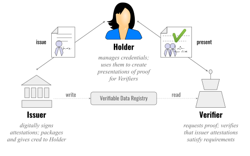

- PUF: Physically Unclonable Function
- VC: Verifiable Credentials
- CCS: Connected Cabin System
- LRU: Line Replacable Unit
- VC: Verifiable Credential
  - Trust model, **issuer** issues credential to a **holder** while the holder can prove identity by
    showing the credential to a **verifier**.

- Cold Cain: Low-temperature supply management, ranging from production to consumption, think of
  vaccines or food

- [MUD: Manufacturer Usage Description](https://resources.infosecinstitute.com/topic/how-to-mitigate-iot-attacks-using-manufacturer-usage-description-mud/)

  - https://www.rfc-editor.org/rfc/rfc8520.html
  - specifies what the responsibilities of the device are
  - any device 'MUD-capable', broadcasts a MUD-file
  - can also just be a feeder pointing to a web server where the file is located

- IDS: Intrusion Detection System
- IPS: Intrusion Prevention System

- Edge Computing: Placement of storage and computing resources closer to source, where data is
  generated
- Fog Computing: Extension of Cloud Computing, bringing it closes to IoT edge devices as sort of
  middle-layer

- TEE: Trusted Execution Environment, secure area in main processor, protected with respect to
  Confidentiality and Integrity
  - ARM Trust Zone
  - RISCV-Trust Zone
