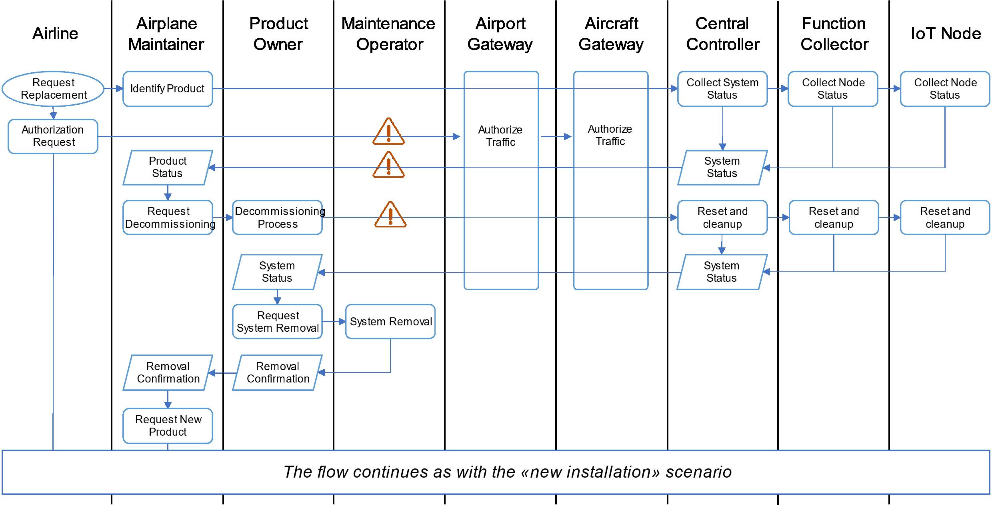

# Use Case

> **Disclaimer**: Content used from CERTIFY Deliverable 1.1

<!--toc:start-->
- [Use Case](#use-case)
  - [Definitions](#definitions)
  - [Domain](#domain)
  - [Actors](#actors)
  - [System under analysis/Functionalities](#system-under-analysisfunctionalities)
  - [Scenarios](#scenarios)
    - [1. Installation of Connected Cabin Systems](#1-installation-of-connected-cabin-systems)
      - [Goals](#goals)
      - [Lifecycle stages involved](#lifecycle-stages-involved)
      - [Actors involved](#actors-involved)
      - [Pre-conditions](#pre-conditions)
      - [Installation](#installation)
        - [Flow of Events](#flow-of-events)
      - [Replacement](#replacement)
        - [Flow of Events](#flow-of-events)
      - [Post-conditions](#post-conditions)
      - [Attack Scenario (Alternative flow of Events)](#attack-scenario-alternative-flow-of-events)
    - [2. System operation and monitoring](#2-system-operation-and-monitoring)
      - [Goals](#goals)
      - [Lifecycle stages involved](#lifecycle-stages-involved)
      - [Actors involved](#actors-involved)
      - [Pre-conditions](#pre-conditions)
      - [Flow of Events](#flow-of-events)
        - [Data Collection and Local Reconfiguration](#data-collection-and-local-reconfiguration)
        - [Data unload and remote analysis](#data-unload-and-remote-analysis)
        - [Data load from remote config](#data-load-from-remote-config)
      - [Post-conditions](#post-conditions)
      - [Attack Scenario (Alternative flow of Events)](#attack-scenario-alternative-flow-of-events)
    - [3. LRU - replacement and re-purposing](#3-lru-replacement-and-re-purposing)
      - [Goals](#goals)
      - [Lifecycle stages involved](#lifecycle-stages-involved)
      - [Actors involved](#actors-involved)
      - [Pre-conditions](#pre-conditions)
      - [Flow of Events](#flow-of-events)
      - [Post-conditions](#post-conditions)
      - [Attack Scenario (Alternative flow of Events)](#attack-scenario-alternative-flow-of-events)
    - [4. Roaming?](#4-roaming)
      - [Goals](#goals)
      - [Actors involved](#actors-involved)
  - [Security Requirements and Technologies](#security-requirements-and-technologies)
  - [Security Risk Assessment](#security-risk-assessment)
  <!--toc:end-->

Our use-case/scenario will highlight the advantages of our proposal in the environment of a
'Connected Cabin system'.

In addition to the use-cases defined in the CERTIFY documentation, we will also explore the
possibilities of enabling roaming on these devices

## Definitions

- PHM: Prognostics and Health Management
- HMI: Human Machine Interface
- Line-Replaceable Unit: modular component of airplane, designed to be replaced quickly

## Domain

**TODO: Explain why it makes sense to employ in this domain**

More and more IoT devices are being deployed in aircraft cabins to improve passenger experience
and airline operations. Benefits of this span from remote prognostics and health management (PHM) to
reduced maintenance time and support a continuous (re-)certification process.

## Actors

- **Airline**
  - Owns the aircraft and oversees interactions and system operations.
- **Airplane maintainer** (e.g., Airplane manufacturer)
  - Oversees maintenance of the aircraft, including the integration of systems designed by different
    manufacturers and their configuration.
- **Product Owner**
  - Oversees design and maintenance of systems deployed in the aircraft on assignment of the
    airplane maintainer
- **Maintenance operator**
  - Works for airplane maintainer
  - E.g., replacement of device or on-site software upgrade (e.g., portable data loader)
- **Passenger, Attendant, Pilot**
  - Interact with aircraft through Human Machine Interfaces, HMI

## System under analysis/Functionalities

**TODO: identify components of system**

- Are we also using the central/function control scenario?

The Aircraft is composed of multiple networks covering various aspects:

- in-flight entertainment, IFE
- aircraft status
- flight maintenance

We will be considering two main network models in the aircraft:

- a two layered config 'A'
  - IoT nodes, Edge nodes, are directly connected to central controller that is managing the CCS functionality
- a three layered config 'B'
  - IoT nodes, edge nodes, are connected to a through a function collector, fog nodes, that manage
    the functionalities of specific subnets

There are three distinct categories for nodes considered:

- IoT (edge) nodes, low-end embedded devices, including actuation, sensing or HMI capabilities, with
  limited room for hardware and software based cyber security (will require offloading to master)
- Function collector (fog nodes), mid to low end devices, less in number, covering role of
  collector/local controller, less constraints than edge nodes
- Central controller, high-end devices with ability to host full fledged security functionalities

External communication will take place through **aircraft gateway** offering services for data
repository, data loading and connectivity with external environment.
The airline operations center, product owner and airplane maintainer can interact through the
airport infrastructure.
A technician may directly access the aircraft if necessary.

## Scenarios

### 1. Installation of Connected Cabin Systems

#### Goals

- Bootstrapping and customization for specific deployment
- Updating
- Decommissioning of previous systems, guaranteeing a reset to a _known and fresh (wiped data)_
  state.

#### Lifecycle stages involved

| Bootstrapping | Operation | Update | Repurposing | Decommissioning |
| ------------- | --------- | ------ | ----------- | --------------- |
| X             | -         | X      | -           | X               |

#### Actors involved

| Airline | Airplane maintainer | Product Owner | Maintenance Operator | Passenger / Attendant / Pilot |
| ------- | ------------------- | ------------- | -------------------- | ----------------------------- |
| X       | X                   | X             | X                    | -                             |

#### Pre-conditions

- Actors involved can establish a secure connection with the aircraft, wireless or wired, through
  airport infrastructure
- Airport and Aircraft network infrastructure can receive authorization requests for needed
  connections from the external environment.
- The Maintenance Operator is provided access to the airplane and to maintenance ports of the target
  CCS.

#### Installation

##### Flow of Events

- Airline requests installation of new component to the Airplane Maintainer also issuing an
  authorization request to Airport and Airplane gateways
- The request is forwarded to the Product Owner and then to the Maintenance Operator, who oversees
  the physical deployment of the product.
- Once connected, Central Controller registers on the Aircraft Network and receives required setup
  to complete network access and system registration.
- Product Owner is now able to reach the CCS, push configuration and security updates to the Central
  Controller, as well as the Function Collector and IoT nodes.
- After the update, the product is registered and the Airplane Maintainer can offer remote services
  to the Airline
- The Airline requests a customization of the CCS. It is performed by the Airplane Maintainer by
  pushing an update package and/or modifying specific configurations as allowed by the Product Owner
  API for Maintenance.
- The new product status is confirmed with a feedback message.

#### Replacement

##### Flow of Events

- Airline requests replacement of a component to the Airplane maintainer, also issuing an
  authorization request to the Airport and Airplane Gateways
- The Airplane Maintainer identifies the target product (location) and collects latest system
  status.
- The Airplane Maintainer issues a decommissioning request to the Product Owner and starts the
  decommissioning process, which causes a reset and cleanup of all the nodes that will be replaced
- After remote reset and clean-up, product owner requests the Maintenance Operator to physically
  remove the system from the cabin.
- The product is then unregistered and can be dismissed.
- The remaining part continues with the 'New installation process flow'

#### Post-conditions

- New component is deployed in the CCS, integrated into the network, updated with latest security
  patches and configured by the Airline for their specific needs.
- Component is securely onboarded in the CCS, unique identity and certificates are dispatched for
  authentication.

#### Attack Scenario (Alternative flow of Events)

- Attacker can inject malicious payloads in place of the intended one, (confidential) credentials
  provided to the Central Controller for network access and authentication ca be stolen.
- IP sensitive data can be lead by the Airplane Maintainer when retrieving system status
- maintenance/reset/cleanup procedures integrity can be compromised

### 2. System operation and monitoring

#### Goals

- periodic collection of data from airplane
- data offload/upload to ground stations for performance monitoring, optimization and PHM operations
- interaction through HMI

#### Lifecycle stages involved

| Bootstrapping | Operation | Update | Repurposing | Decommissioning |
| ------------- | --------- | ------ | ----------- | --------------- |
| -             | X         | X      | -           | -               |

#### Actors involved

| Airline | Airplane maintainer | Product Owner | Maintenance Operator | Passenger / Attendant / Pilot |
| ------- | ------------------- | ------------- | -------------------- | ----------------------------- |
| X       | X                   | X             | -                    | X                             |

#### Pre-conditions

- Device bootstrapping, enrollment, configuration, provisioning are completed for all devices, that
  are (statically) part of the network.
- Maintainers have established remote secure connection with the aircraft (wireless or wired)
  through the airport infrastructure.
- Passengers/Attendants/Pilots can interact through HMI or are connected through some BYOD.
- IoT devices are equipped with sensors to collect and store data that are then forwarded to their
  root controller.
- Devices can securely store and transmit collected data.

#### Flow of Events

- IoT devices collect data during airplane operations
- Data are securely stored
- Local computations over critical & non-critical data are executed in separate environments to
  reconfigure the airplane/flight **What is meant by this?**
- Remote entities are authenticated and a connection is established with the aircraft network
  through the gateway. **What Gateway? We are basically in flight so shouldn't we be disconnected?
  Otherwise this is a scenario for _Roaming_**
- Data from plane are downloaded to ground **Wouldn't that be more like uploading?** (from plane to
  ground)
- In case of Airplane fleet, Collective Analysis is performed
- Upload new data and configurations (from ground to plane)
- Data authenticity and integrity are verified before updating the configurations on the plane.

##### Data Collection and Local Reconfiguration

Note: reconfigurations during flight operations should be predefined at design time, in case of
failure/intrusion/anomalies **system** can transition to "fail safe" mode. (Devices should be
isolated)

##### Data unload and remote analysis

Note: Format of exchange and digital contents between businesses (airline, maintainer and product
owner) is compliant with ARINC 827 data load standard.

##### Data load from remote config

#### Post-conditions

- A new configuration, computed either locally or through the remote connection with the operations
  center is available
- Data from the aircraft are available for further analysis of airline
- For the configurations, integrity is verified, and confidentiality has been preserved (as it could
  involve IP issues) in the process.
- For the data, in addition to integrity and confidentiality, it is important to also ensure
  availability (to detect early sings of potential problems).

#### Attack Scenario (Alternative flow of Events)

- The main entry point is the WIFI access point.
- Rouge device can inject false data, config or software to facilitate subsequent attacks or cause
  system failure/malfunctioning.
- Alternatively, in stealth mode, sensitive information could be captured and intelligence about the
  system configuration could be used to perpetrate other attacks.

### 3. LRU - replacement and re-purposing

> **maybe skip this? Does not seem too different from the replacement in scenario 1**

#### Goals

- to minimize downtime in case no LRU is available, compatible spare LRU is retrieved from
  manufacturer and re-purposed for specific target system

#### Lifecycle stages involved

| Bootstrapping | Operation | Update | Repurposing | Decommissioning |
| ------------- | --------- | ------ | ----------- | --------------- |
| -             | -         | X      | X           | X               |

#### Actors involved

| Airline | Airplane maintainer | Product Owner | Maintenance Operator | Passenger / Attendant / Pilot |
| ------- | ------------------- | ------------- | -------------------- | ----------------------------- |
| X       | X                   | X             | X                    | -                             |

#### Pre-conditions

- Actors involved can establish remote secure connection with aircraft
- Airport has spare LRU compatible with CCS
- Maintenance Operator is provided access to the airplane and to the maintenance ports

#### Flow of Events

- Airline requests to the Airplane Maintainer the repair of a cabin system, issuing and
  authorization request to the Airport/Airplane gateways for following remote software update
  operations.
- Airplane Maintainer identified target product (location) and the failure condition then requests
  repair to product owner
- Product Owner starts LRU removal process, including reset and cleanup
- Failed LRU removal executed locally by Maintenance Operator (also in charge of reset and cleanup)
- Product owner informs Airplane Maintainer of the removal and receives information of available
  replacement LRUs.

#### Post-conditions

- New LRU deployed, integrated into network, updated with latest security patches and configured by
  the Airline for specific needs
- CCS is registered with unique identifier and certificates are dispatched for authentication
- For the configuration, integrity is verified and confidentiality has been preserved (for IP
  protection) in the process

#### Attack Scenario (Alternative flow of Events)

- Same attacks as in [new installation](#installation)

### 4. Roaming?

#### Goals

- Devices checking in at airport gateway should be able to checkout and check in at arriving
  destination. Needs rechecking and or re-certifying DID.

#### Actors involved

## Security Requirements and Technologies

Following operation mode is inspired by ARINC 664.

> Regulations are not that relevant to us right?

## Security Risk Assessment

