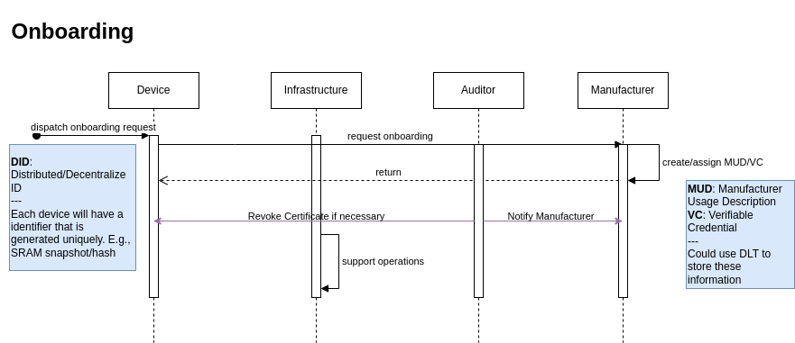
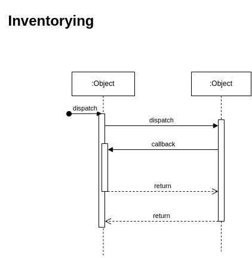

# Functional Architecture

<!--toc:start-->

- [Functional Architecture](#functional-architecture)
  - [Definitions](#definitions)
  - [Protocols Considered](#protocols-considered)
  - [Onboarding](#onboarding)
  - [Inventorying](#inventorying)
  - [Updating](#updating)
  - [Security-Information Sharing](#security-information-sharing) - [External Stakeholders](#external-stakeholders) - [Cybersecurity Assessment](#cybersecurity-assessment) - [Security Levels](#security-levels)
  <!--toc:end-->

## Definitions

- TOE: Target of Evaluation
- CCS: Connect Cabin System

## Protocols Considered

- [ARINC 827](https://standards.globalspec.com/std/14317873/ARINC%20827)
- [ARINC 429](https://en.wikipedia.org/wiki/ARINC_429)
  - Communication bus
- [ARINC 717](https://en.wikipedia.org/wiki/ARINC_717)
  - digital flight data recorder with inputs and outputs
- Ethernet
- WIFI

## Onboarding

[Related Scenario: Installation of CCS](/thesis/1-use-cases.md#1-installation-of-connected-cabin-systems)

- Each devices stores security level associated with it.
- DID provided inside a DLT, which could be the one used by CERTIFY 'Hyperledger Aries'
- VC gets created by the manufacturer and returned to the device.
  - the VC gets verified by the infrastructure and also the auditor, while the auditor is able to
    revoke the certificate if needed.
    - Verification of Certificate, whether revoked or not, possible through e.g., a **smart
      contract** based on a **cryptographic accumulator**
- Storing of MUD file i.e. VC?
  - Secure Encryption, SE, unit of STM is no yet available
  - [ ] **define how storing will work!**

## Inventorying

## Updating

- only allow verified images
- **Lightweight Machine-to-Machine technical specification** by Open Mobile Alliance, OMA, based on
  transport layer security
- Software Updates for IoT, SUIT, by IETF, focuses on definition of communication architecture and
  information model of manifest files to describe firmware images based on recent sec. standards,
  e.g., CBOR Object Signing and Encryption, COSE

- Interledger approaches will be considered, as interoperability of multiple blockchains is
  important

## Security-Information Sharing

To enable security information sharing, we will be relying on the #Hyperledger platform

- Directional Information Sharing
  - Device receives
    - vulnerability information
    - updates
    - MUD files
  - External sources:
    - zero-day vulnerabilities
    - patch/re-certification

### External Stakeholders

- certification authority
- vulnerability database
- manufacturer
- etc.

### Cybersecurity Assessment

May encompass: (according to CERTIFY deliverable 1.1), probably need to choose one or at least be
more definitive

- Continuous Impact Assessment:
  - Changes made to IoT device continuously monitored. Using Impact Analysis Report (IAR) or more
    modern dynamic, real-time impact system ???? what would that be?
- Automated Evaluation:
  - ML algorithms could be applied to evaluate changes. Learning from part incidents predict and
    categorize impact
- Real-Time Monitoring and Reporting:
  - Continuous monitoring system providing real time status of security certification. Could be
    achieved by creating dashboard that continuously updates certification status. System would also
    alert relevant Stakeholders on significant changes and risks.
- Continuous re-evaluation and re-assessment:
  - Instead of waiting for changes, do checks at frequent intervals
- Cloud-based Certification Maintenance Platform (Cyberpass):
  - Platform enabling

### Security Levels

Referring to the CERTIFY Security levels, BASIC to HIGH, defined as follows

- Basic
  - Focus on common and simple cyber threats
  - User authentication, access controls, basic security configuration
- Substantial
  - more robust security measures including intrusion detection systems, incident response plans and
    periodic security assessments
- High
  - Requires organizations to establish a comprehensive and proactive cybersecurity programs
  - Advanced security measures, network segmentation, encryption, continuous monitoring, regular
    vulnerability assessments.
  - Threat intelligence sharing and regular security audits

Our use case, CCS, will generally rely on security level 'HIGH', which from a cybersecurity
viewpoint is a volatile and highly targeted environment.
