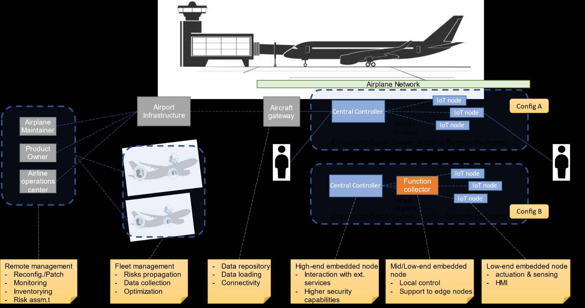
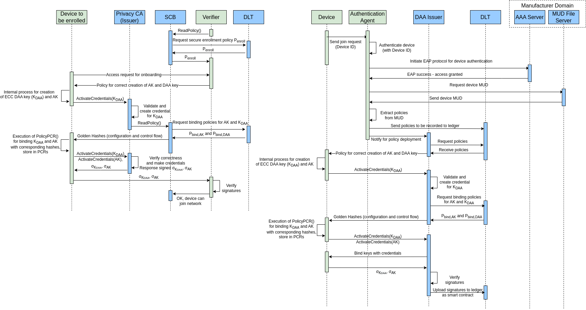

# Milestones

Need to specify what will be submitted

## Milestone 1: Definition of use cases incl. actors, requirements, and functionalities

[See use-case document](./use-cases.md)

What would I be to do here? There are already 3 use cases. Am I to define more? Or choose one of the
three use cases, favoring the aircraft cabin scenario, and expand upon further than current
documentation?

### Connected Cabin System

#### Goals
- Faster re-certification for devices entering/changing location.

- Config A and B

### TODO

- Setup meeting/setup with Collins.

### Deliverables

Classic simple document with planning and ideas.

## Milestone 2: Functional architecture developed

I found the following two diagrams:

### Deliverables

Documentation, diagrams

## Milestone 3: Target IoT device selected

- Already thought of `Raspberry Pi Pico`:
  - good documentation
  - #MicroPython support (as well as #CircuitPython, if relevant)

### Deliverables

Documentation including specific hardware.

## Milestone 4: Target hyper ledger platform selected

In the proposal #bifroest and #interledger are mentioned while we also talked about #ethereum.
Found [Hyperledger Besu](https://besu.hyperledger.org/en/stable/) in WP2 presentation.

### Deliverables

Document including selected ledger platform

## Milestone 5: Specification & implementation of the DLT-based Configuration Management Database (CMDB)

### Deliverables

Document and implementation

## Milestone 6: Specification & implementation of the device onboarding

### Deliverables

Document and implementation

## Milestone 7: Initial experimentation with the platform accomplished

### Deliverables

Implementation/Experimentation

## Milestone 8: Specification & implementation of the OTA Upgrading

### Deliverables

Document and implementation

## Milestone 9: Specification & implementation of the MUD threat mechanism

### Deliverables

Document and implementation

## Milestone 10: Experimentation of the integrated prototype completed

### Deliverables

Implementation/Experimentation

## Milestone 11: Evaluation of the results focusing on different use cases

### Deliverables

Documentation

## Milestone 12: Documentation of the developed approach and Final presentation

### Deliverables

Documentation and evaluation.
